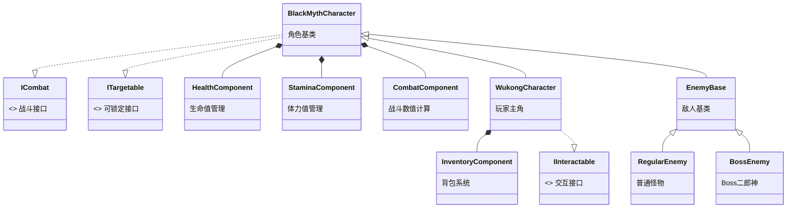

# BlackMyth_Wukong
2025年秋 同济大学程序设计范式期末大作业

## 项目简介
本项目参考同名游戏《黑神话·悟空》，实现了一款第三人称动作冒险游戏。游戏以东方神话为主题，玩家操纵“悟空”角色，在3D场景中进行探索与战斗。项目实现了核心的战斗系统（攻击、闪避、法术）、敌人AI（普通怪物与Boss二郎神）、以及完整的游戏循环（存档、商店、场景切换）。

## 成员分工

| GitHub ID | 分工比例 | 具体完成的类与模块设计 |
| :--- | :--- | :--- |
| **wendaining** | 25% | **核心框架与主角系统**： - `WukongCharacter`: 悟空主角逻辑（移动、攻击、状态机） - `HealthComponent`, `StaminaComponent`, `CombatComponent`: 核心数值组件 - `WukongClone`: 分身术技能实现 - `PerformFreezeSpell`: 定身术技能实现 - `RestingBarrier`: 安息术（画地为牢）实现 - `AnimNotify_PoleStanceAOE`: 立棍重击AOE判定 - `ButterflyPawn`: 变身术（蝴蝶）实现 - `NPCCharacter` & `Dialogue`: NPC交互与对话系统 - `InteractInterface`: 交互接口设计 |
| **Palind** | 25% | **敌人AI与Boss系统**： - `EnemyBase`: 敌人基类（状态机、感知、受击反馈、硬直韧性、属性） - `RegularEnemy`, `RangedEnemy`: 近战与远程小怪实现 - `BossEnemy`: Boss二郎神逻辑（多阶段、技能、连招） - `XiaoTian`: 哮天犬召唤物逻辑 - `EnemyAIController`: 行为树与黑板控制 - `BossCombatTrigger`: Boss战区域触发器 - `BossAnimInstance`: Boss动画状态机 |
| **Aphrody-Dy** | 25% | **物品、商店与状态系统**： - `InventoryComponent`: 背包与道具管理组件 - `ItemBase` (及子类): 道具系统基类 - `StatusEffectComponent`: 状态效果管理（Buff/Debuff） - `SceneStateComponent`: 场景切换组件 - `EnemyDodgeComponent`: 敌人闪避逻辑组件 - `ShopManager`: 商店交易逻辑 - `TradeMenuWidget`: 商店UI实现 - `GoldPickup` / `GoldComponent`: 金币掉落与拾取逻辑 - `TraceHitbox`: 攻击判定优化 |
| **onnisama** | 25% | **系统功能与UI交互**： - `BlackMythSaveGame`: 存档/读档系统底层实现 - `Temple`: 土地庙交互逻辑（更新重生点、恢复状态等） - `TeleportMenuWidget` / `TeleportButtonWidget`: 传送系统UI - `MainMenuWidget`, `PauseMenuWidget`: 菜单系统 - `SaveMenuWidget`, `LoadMenuWidget`: 存档界面逻辑 - `EnemySpawner`: 赋名刷怪系统 - `DeathMenuWidget`: 死亡界面以及重生逻辑实现 |

## 项目组成
项目主要目录结构如下：

- **/docs**
  - 包含所有项目文档（设计文档、执行计划、协作规范等）。
- **/BlackMyth/Source/BlackMyth**
  - **核心代码库**，包含所有 C++ 类实现：
    - `/Components`: 通用组件（生命、体力、背包、状态等）。
    - `/Combat`: 战斗相关逻辑。
    - `/AI`: 敌人行为树与控制器。
    - `/UI`: 所有 Widget 的 C++ 后端逻辑。
    - `/Items`: 道具类定义。
- **/BlackMyth/Content**
  - **美术资产**：包含模型、材质、动画、音效、蓝图等。

## 实现功能概览

### 基础功能
1.  **角色系统**
    - 利用悟空的高精度模型与动画实现了流畅的动作。
    - 支持行走、奔跑、跳跃、翻滚/闪避等基础运动。
    - 实现了轻击三连段、重击、立棍AOE等攻击方式。
    - 完整的状态机切换（Idle / 攻击 / 受击 / 死亡）。
2.  **战斗系统**
    - 实现了基于组件的生命值与体力值管理。
    - 实现了受击硬直与击退反馈。
    - 实现了四种核心技能：分身术（召唤分身）、定身术（定住敌人）、变身术（化身蝴蝶）、安息术（画地为牢）。
    - 精确的 Hitbox 攻击判定与实时碰撞检测。
3.  **敌人与 Boss**
    - 实现了近战兵、远程兵、持剑/斧精英怪等多种普通敌人。
    - 实现了 Boss **二郎神**，具备多阶段战斗逻辑、专属技能（召唤哮天犬、长枪连招）与怒气状态。
    - 敌人具备基于行为树的 AI：巡逻、侦测玩家、追击、攻击、闪避。
    - 实现了敌人的攻击、受击、硬直等互动。
4.  **场景功能**
    - 支持广阔的 3D 场景探索与移动。
    - 包含战斗区域限制（空气墙）与场景切换点。
    - 支持动态背景音乐切换（探索/战斗/Boss战）。
5.  **UI功能**
    - 实现了主菜单、暂停菜单、死亡重开界面。
    - 战斗 HUD：玩家血条/体力条、Boss 专属血条、技能冷却显示、连击数显示。
    - 实现了商城交易界面与背包界面。

### 扩展功能
- **技能系统**：实现了多样化的法术技能（分身、定身），丰富了战斗策略。
- **变身系统**：实现了变身蝴蝶进行侦查或规避战斗的功能。
- **法宝/道具系统**：实现了背包管理、道具使用（如恢复药水、体力药水等）。
- **剧情与交互**：实现了 NPC 对话系统与剧情演出。
- **存档/读档系统**：实现了随时随地对游戏进度进行存档，并支持从主菜单和暂停菜单读取进度。
- **土地庙系统**：集成了存档重生点、传送至其他土地庙、商店交易、状态恢复等功能。

## 项目架构与类设计

本项目采用 Unreal Engine 典型的 **Actor-Component** 架构，结合 **MVC** 思想进行 UI 与逻辑分离，确保了代码的高内聚低耦合。

### 1. 核心类层次结构

项目基于 UE 的反射机制构建了清晰的继承体系，主要分为角色、物品、状态效果三大分支：

*   **角色体系**
    *   `ACharacter` (UE基类)
        *   `ABlackMythCharacter`: 项目角色基类，封装通用摄像机 (`SpringArm`, `Camera`)、输入映射上下文 (`InputMappingContext`) 及基础移动逻辑。
            *   `AWukongCharacter`: 玩家控制的主角。实现了复杂的战斗状态机 (`EWukongState`)、技能系统（定身、变身、分身）、背包交互接口及与 NPC/场景物体的交互逻辑。
            *   `ANPCCharacter`: 中立 NPC 基类。挂载 `UDialogueComponent`，处理对话数据加载与交互触发。
            *   `AEnemyBase`: 敌人基类。集成 AI 控制器接口、感知组件 (`PawnSensing`)、属性组件 (`Health`, `Stamina`) 及受击/死亡流程。
                *   `ARegularEnemy`: 普通近战敌人，实现基础巡逻与近身攻击。
                *   `ARangedEnemy`: 远程敌人，扩展了投射物生成与远程 AI 行为。
                *   `ABossEnemy`: Boss（如二郎神）。扩展了多阶段战斗 (`EBossPhase`)、霸体/韧性机制、特定技能（召唤哮天犬）及过场动画触发器。

*   **物品与交互体系**
    *   `AActor` (UE基类)
        *   `AInteractableActor`: 可交互物体基类。实现了 `IInteractInterface` 接口，用于土地庙 (`Temple`) 等场景设施，支持交互范围检测与 UI 提示。
        *   `APotionActor`: 药瓶可视化 Actor，用于喝药动画中的模型挂载。
        *   `AGoldPickup`: 掉落物基类。实现了自动吸附/按键拾取逻辑与 HUD 动画。

*   **状态效果体系 (Status Effects)**
    *   `UObject` (UE基类)
        *   `UStatusEffectBase`: 状态效果抽象基类。定义了 `ApplyEffect`, `RemoveEffect`, `TickEffect` 等虚接口。
            *   `UPoisonEffect`: 中毒效果，持续扣血并禁用部分动作。
            *   `USlowEffect`: 减速效果，修改角色移动速度属性。
            *   `UAttackBuffEffect` / `UDefenseBuffEffect`: 数值增益效果。

### 2. 组件化设计

为了降低耦合，核心功能被封装为组件 (`UActorComponent`)，可复用于不同角色：

*   **战斗核心**：
    *   `UCombatComponent`: 处理攻击判定框 (`Hitbox`) 管理、连招窗口 (`Combo Window`) 记录及攻击状态流转。
    *   `UTraceHitboxComponent`: 基于动画通知 (`AnimNotify`) 的精确武器碰撞检测组件。
*   **属性管理**：
    *   `UHealthComponent`: 管理生命值、无敌帧及死亡回调。
    *   `UStaminaComponent`: 管理体力值消耗与恢复（奔跑、翻滚、攻击）。
*   **系统功能**：
    *   `UInventoryComponent`: 背包组件，管理 `FItemData` 列表、快捷栏映射及物品使用逻辑。
    *   `UDialogueComponent`: 对话组件，解析 CSV 数据表，管理对话索引与 UI 显示。

### 3. 模块间关系

*   **逻辑与表现分离 (MVC)**：
    *   **Model**: `AWukongCharacter` 等类维护核心数据（血量、金币、背包）。
    *   **View**: `UPlayerHUDWidget`, `UInventoryBarWidget` 等 UMG 控件负责显示。
    *   **Controller/Bridge**: 通过多播委托 (`OnHealthChanged`, `OnGoldChanged`) 通信。角色状态变化时广播事件，UI 监听并更新，互不持有引用。
*   **AI 决策系统**：
    *   `AEnemyAIController` 持有行为树 (`Behavior Tree`) 和黑板 (`Blackboard`)。
    *   `AEnemyBase` 作为执行者，提供 `Attack()`, `MoveTo()` 等原子操作供行为树节点调用。
    *   感知组件 (`AIPerception`) 收集环境信息写入黑板，驱动行为树分支切换（巡逻 -> 追击 -> 攻击）。

## 系统模块与技术细节

### 1. 战斗与技能系统
战斗系统是游戏的核心体验。
- **攻击判定**：通过 `UTraceHitboxComponent` 配合动画通知 (`AnimNotify_ActivateHitbox`) 实现精确的武器碰撞检测。支持多段连招，通过 `OpenComboWindow` 和 `CloseComboWindow` 通知管理输入缓冲。
- **技能体系**：
  - **定身术**：锁定目标后施加定身状态，敌人模型材质高亮（金色），并停止行为树逻辑。
  - **立棍 AOE**：实现范围伤害检测。
  - **变身术**：实现了变身蝴蝶的机制，包含独立的 `ButterflyPawn`、输入映射切换及 CD 管理。
  - **分身术**：生成另外两个悟空角色，具有自己的AI，可以辅助玩家。
  - **安息术**：画地为牢，实现无敌的空气墙，阻碍敌人的攻击。
- **数值与状态**：
  - **硬直**：引入韧性条机制，韧性耗尽时触发受击动画，打断当前行为。
  - **体力限制**：攻击、翻滚、疾跑均消耗体力，体力不足时限制特定动作。
  - **友伤屏蔽**：基于 `ETeam` 枚举区分阵营，防止同阵营误伤。

### 2. 敌人 AI 与 Boss 战
敌人 AI 基于行为树 (Behavior Tree)构建，实现了分层决策。
- **普通敌人**：
  - **感知系统**：利用 `UPawnSensingComponent` 视觉与听觉感知玩家。
  - **行为模式**：实现了巡逻 (`BTT_FindRandomPatrol`)、追击、攻击 (`BTT_Attack`) 三种状态的流转。
  - **兵种差异**：近战兵（普通/斧头/持剑精英怪）侧重近身压制，远程兵 (`ARangedEnemy`) 保持距离并发射投射物。
- **Boss 二郎神**：
  - **多阶段战斗**：根据血量触发阶段转换，二阶段解锁新技能与特效。
  - **技能组合**：包含轻重击连招、闪避、以及召唤哮天犬 (`XiaoTian`) 进行协同攻击。
  - **场景互动**：通过 `BossCombatTrigger` 划定战斗区域，触发空气墙防止玩家脱战，并切换战斗 BGM。
  - **CG动画实时渲染**：给玩家带来丰富剧情体验。

### 3. 土地庙系统
土地庙作为游戏的核心交互枢纽，集成了多种功能模块。
- **交互框架**：基于 `IInteractInterface` 接口，玩家进入范围后显示按键提示 (`G`)，触发 `TempleMenuWidget`。
- **传送网络**：
  - 支持在预设的土地庙之间传送。
  - 解决了传送后的地形高度适配问题，防止角色卡入地底。
- **功能集成**：
  - **休息**：回复满血量与体力。
  - **重生点**：激活土地庙后自动记录为重生点 (`Respawn Point`)。
  - **商店入口**：直接关联交易界面，购买消耗品与强化道具。

### 4. 物品与背包系统
- **背包管理**：
  - `UInventoryComponent` 维护物品数据，支持物品的添加、移除与使用。
  - 实现了快捷栏映射，按 `I` 键打开背包时，数字键 `1-4` 用于选择装备；关闭背包时恢复为技能释放键。
- **物品类型**：
  - **消耗品**：如药瓶 (`PotionActor`)，使用时播放喝药动画并挂载模型。
  - **增益道具**：如怒火丹（攻击 Buff）、金刚丹（防御 Buff），使用后通过 `UStatusEffectComponent` 施加效果。

### 5. 状态效果系统
采用组件化设计，`UStatusEffectComponent` 负责管理所有挂载在角色身上的效果。
- **架构设计**：`UStatusEffectBase` 作为基类，定义了 `OnApply`, `OnTick`, `OnRemove` 生命周期。
- **具体效果**：
  - **中毒**：持续扣血，并禁用攻击等高体力动作。
  - **减速**：修改 `UCharacterMovementComponent` 的 `MaxWalkSpeed`。
  - **UI 表现**：状态图标动态显示在 HUD 上，包含倒计时遮罩与层数显示。

### 6. 经济与商店系统
- **金币循环**：
  - **产出**：敌人死亡掉落 `AGoldPickup` Actor。
  - **拾取**：支持按 `F` 键吸附拾取，金币飞向 HUD 金币栏的动画轨迹经过贝塞尔曲线平滑处理。
- **交易系统**：
  - `ShopManager` 单例类管理商品列表 (`FShopItemData`)。
  - 商店 UI 支持商品预览、价格检查与购买确认，购买成功后自动扣除金币并存入背包。

### 7. 剧情与交互系统
- **对话系统**：
  - **数据驱动**：使用 CSV 表格导入对话数据 (`FDialogueEntry`)，包含文本、说话人、时长等信息。
  - **演出控制**：对话开始时自动切换摄像机视角（特写/过肩），对话结束后恢复。
  - **状态约束**：对话期间禁用玩家移动与攻击输入，防止穿模或逻辑中断。

### 8. 场景与存档
- **场景管理**：
  - 实现了探索、普通战斗、Boss 战三种场景状态的无缝切换，自动淡入淡出背景音乐 (`BGM`)。
- **持久化数据**：
  - `UBlackMythSaveGame` 继承自 `USaveGame`，序列化玩家属性（血量、位置、金币）、背包数据及世界状态（Boss 击杀标记）。
  - 支持多存档槽位，读档时通过 `UGameplayStatics::OpenLevel` 重新加载地图并恢复状态。

## 项目开发日志

### 2025-11-24

* [Git 协作规范](/docs/cooperatingSpecification.md)制定
* 明确分支管理策略
* 开始学习UE5.4的基础使用

### 2025-12-02

* UE5 项目工程建立
* 导入基础资产

### 2025-12-03

* 实现悟空基础移动（跑、跳）
* 实现基础攻击动作
* 引入 Paragon 资源包

### 2025-12-04

* 抽象出 `HealthComponent` 组件
* 抽象出 `StaminaComponent` 组件
* 抽象出 `CombatComponent` 组件
* 重构角色属性逻辑
* 实现生命值与体力值 UI

### 2025-12-05

* 引入 `EnemyBase` 基类
* 实现敌人基础感知 AI
* 实现敌人追踪 AI
* 增加项目设计架构文档

### 2025-12-08

* 完善攻击判定（TraceHitbox）
* 修复连招 Bug
* 修复位移 Bug
* 重构角色蓝图

### 2025-12-10

* 导入敌人模型与动画
* 实现混合空间（BlendSpace）
* 优化敌人追逐速度

### 2025-12-11

* 初步实现主菜单并对后续功能完成规划

### 2025-12-12

* 初步实现暂停菜单
* 初步实现存档/读档 UI 框架
* 增加敌人受击动画与音效
* 增加新敌人类型（斧头兵、剑兵）

### 2025-12-14

* 实现视角锁定（Lock-on）功能
* 优化战斗手感
* 增加被锁定敌人的视觉提示
* 修复敌人视野 Bug

### 2025-12-15

* 实现定身术技能
* 初步实现 NPC 对话系统
* 实现对话 UI 组件
* 增加新地图

### 2025-12-17

* 存档系统功能实装
* 实现状态效果（中毒/减速）
* 变身术（蝴蝶）实装
* 优化 NPC 交互逻辑
* 增加背景音乐

### 2025-12-20

* 二郎神 Boss 实装
* 实现 Boss 技能（召唤哮天犬）
* 实现 Boss 多阶段逻辑
* 背包系统上线
* 道具系统上线
* 土地庙交互功能实装

### 2025-12-21

* 土地庙传送功能实装
* 安息术、立棍AOE重构
* Boss 战空气墙实装
* 优化 Boss 战斗体验

### 2025-12-24

* 土地庙商店系统完成
* 金币掉落与拾取功能完成
* 死亡重生机制完善

### 2025-12-27

* 修复 Boss 硬直 Bug
* 修正地图问题
* 移除 Debug 线条
* 项目收尾与最终合并

### 2025-12-28

* 完成项目文档

## 文档更新日期

2025年12月28日
